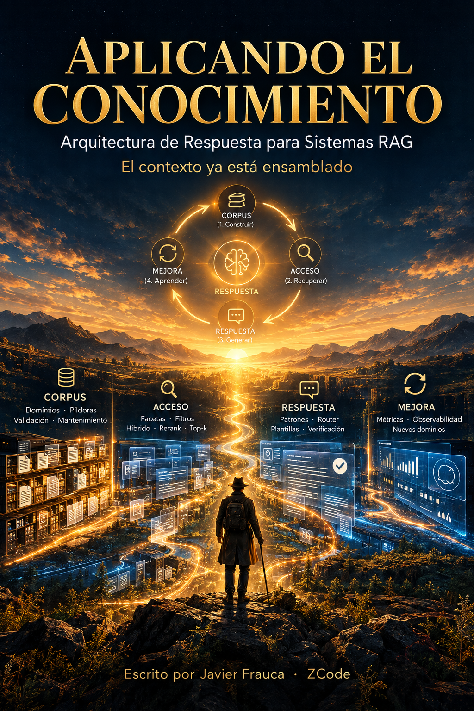

# Aplicando el Conocimiento

**Arquitectura de Respuesta para Sistemas RAG — El contexto ya está ensamblado**

> *El corpus está construido y la cosecha, guardada. Ahora toca responder con ella — y hay muchas maneras de responder.*

Tercera entrega de la serie iniciada con [*El Origen del Conocimiento*](https://javierfrauca.github.io/el-origen-del-conocimiento/) (léase online en [javierfrauca.github.io/el-origen-del-conocimiento](https://javierfrauca.github.io/el-origen-del-conocimiento/)) y continuada con [*Accediendo al Conocimiento*](https://javierfrauca.github.io/accediendo-al-conocimiento/).

## La tesis

No existe "un RAG": existe un espectro de patrones de respuesta — directo, iterativo, autocorrectivo, agéntico, multi-agente — ordenados por cuánto piensa el sistema antes de hablar. Ninguno es mejor que otro: la **audiencia y el alcance** deciden. El que responde rápido no investiga; el que investiga llama a varias herramientas y paga cada vuelta en latencia, coste y superficies de fallo. Este libro cierra el ciclo de la serie: sembrar el conocimiento (I), cosecharlo (II), y ahora — preparar la respuesta (III).

## Qué encontrarás

Como en las entregas anteriores: **sin código** — método, criterio y plantillas. Escrito mientras se mantiene en producción el RAG real de un despacho laboral.

- 5 partes, 17 capítulos, prólogo, epílogo, apéndices y glosario.
- Una brújula de 5 pasos para la orilla que los dos libros anteriores rozaron sin cruzar: la respuesta final y su evaluación.

## Estado

✅ **Edición completa (pendiente de revisión)** — prólogo, 17 capítulos, epílogo, apéndices A-F y glosario redactados (07-09-2026); ~52.000 palabras. Léase online en [javierfrauca.github.io/aplicando-al-conocimiento](https://javierfrauca.github.io/aplicando-al-conocimiento/).

## Licencia

CC BY-NC-SA 4.0 — Javier Frauca & ZCode (GLM, Z.ai). Coautoría humano-IA declarada. Ver [LICENSE.md](LICENSE.md).
