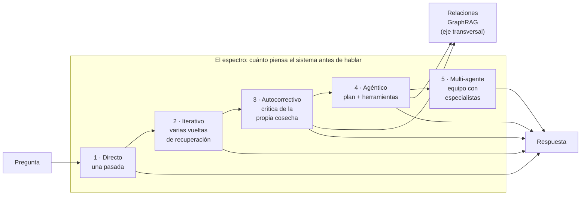

# 2 · El espectro de la respuesta

Pregúntale a tres equipos que tengan un sistema RAG en producción qué tipo de sistema tienen y escucharás tres respuestas que no se pueden comparar. Uno dirá que tiene "un chatbot con búsqueda". Otro dirá que tiene "un agente". Un tercero dirá algo sobre embeddings y no responderá a la pregunta. El vocabulario de esta industria — asistente, copiloto, agente, pipeline, flow — es un catálogo de marketing sin unidades de medida. Y sin unidades de medida no hay arquitectura: hay opiniones.

Este capítulo propone la unidad de medida. Una sola, y de hecho es una pregunta, no una métrica: **¿cuánto piensa el sistema antes de hablar?** Con esa pregunta ordenada en un eje, todos los sistemas RAG del mundo — los nuestros, los de los competidores, los de las demos de moda — se colocan en una línea continua que va de la respuesta inmediata a la investigación deliberada. Esa línea es el espectro de la respuesta, y saber situar en él un sistema es saber casi todo lo importante sobre él: cuánto tarda, cuánto cuesta, qué errores comete y para qué sirve.

## El eje: cuánto razonamiento hay entre la pregunta y la respuesta

La pregunta "¿cuánto piensa antes de hablar?" se puede formular con precisión técnica: ¿cuántas transformaciones y decisiones intermedias ocurren entre la llegada de la consulta y la salida de la respuesta? En un extremo, ninguna: el sistema recupera una vez, ensambla el contexto y redacta. En el otro, muchas: el sistema descompone la pregunta, planifica pasos, invoca herramientas, examina resultados intermedios, corrige el plan, vuelve a recuperar, se critica a sí mismo y solo entonces redacta.

Cada transformación intermedia compra una capacidad y paga un precio. La capacidad es evidente: un sistema que puede recuperar dos veces responde preguntas que necesitan dos recuperaciones; uno que puede consultar una calculadora responde preguntas con aritmética. El precio es menos visible pero igual de real: cada transformación añade latencia, coste en tokens, un punto donde el software puede fallar y —el más traicionero de todos— un punto donde el razonamiento puede desviarse. Un paso intermedio equivocado no produce un paso equivocado: produce pasos siguientes equivocados *porque* aquel fue equivocado.

Por eso el espectro es un espectro y no un catálogo: los puntos intermedios existen, se pueden combinar y se deben elegir por necesidad demostrable, no por entusiasmo. Vamos a recorrerlo.

## Primera estación: el directo, la pasada única

El **RAG directo** — también llamado *one-shot*, y conviene fijar el término porque aparecerá en todo el libro — es el patrón del capítulo anterior: la consulta llega, el motor recupera, el contexto se ensambla, el modelo redacta. Una vuelta. Fin.

Su fama de "básico" es la fama que tiene la llave inglesa entre las herramientas: la más antigua, la más barata, la que resuelve el noventa por ciento de los problemas y la única que cabe en cualquier bolsillo. Un sistema directo responde en segundos porque solo llama al modelo una vez; cuesta lo que cuesta un contexto y una redacción; y tiene una virtud que ninguna investigación paga: es **auditable de un vistazo**. La trazabilidad completa — qué consultó, qué recuperó, qué contestó — cabe en una página que un humano puede leer entera. Cuando un regulador, un auditor o un abogado pregunta "¿por qué dijo esto?", el sistema directo tiene respuesta literal.

Su límite es estructural, no de ajuste: **no tiene réplica interna**. No se mira a sí mismo. Si la cosecha fue pobre, la respuesta será pobre con la misma seguridad tipográfica que si la cosecha fue excelente. No sabe que no sabe. Y hay preguntas que una pasada no puede responder ni con la mejor cosecha: las que necesitan juntar dos piezas separadas del corpus, las que dependen de un cálculo, las que empiezan por "¿en cuáles de mis...?".

Casos de uso donde el directo es la respuesta correcta: la pregunta fáctica de alta frecuencia — plazos, condiciones, procedimientos, cifras — en un corpus bien curado. El bot de soporte de nivel uno de una operadora de telecomunicaciones que responde cuarenta mil veces al día "¿cuánto tarda la portabilidad?". El portal de recursos humanos que responde "¿cuántos días de vacaciones me quedan?". Cuando la pregunta es el ochenta por ciento de la cola y la respuesta vive en una píldora, el directo no es el patrón barato: es el patrón justo.

## Segunda estación: el iterativo, recuperar otra vez

En seguida viene el patrón que descubre que una pasada no basta. El **RAG iterativo** permite al sistema volver al rack: recuperar, examinar lo recuperado, darse cuenta de que falta algo, y formular una nueva búsqueda — mejor informada que la primera — antes de redactar.

La técnica canónica es el **self-ask**: el sistema se descompone la pregunta en subpreguntas y las responde en orden, cada una con su propia recuperación. Ante "¿qué fabricantes de los que homologamos tienen revisiones obligatorias este trimestre?", un sistema directo se ahoga: la respuesta no está en ningún documento, es la intersección de tres. Un iterativo pregunta primero por la lista de fabricantes homologados, luego por las revisiones obligatorias de cada uno, y redacta al final con las piezas juntas.

Una variante más sofisticada es **FLARE**: el sistema empieza a redactar antes de tener todo el conocimiento, y cuando su propio borrador se queda sin material — cuando aparecen frases que no puede respaldar — interrumpe, recupera para esa frase concreta, y sigue. Recuperar deja de ser un paso previo y se convierte en una necesidad del texto, como volver al diccionario mientras se escribe.

El precio del iterativo se paga en vueltas: cada una es latencia y tokens. Por eso todo sistema iterativo serio lleva un **presupuesto de vueltas** — un máximo que no se supera — y una **señal de parada**: el criterio que le dice "ya sabes lo suficiente, redacta". Sin presupuesto, el iterativo degenera en bucle; con presupuesto razonable, responde en diez o veinte segundos lo que el directo no responde en ninguno.

Casos de uso: los panoramas ("¿qué dice la regulación sobre...?"), las comparaciones ("¿qué modelo de póliza cubre X y cuál no?"), las preguntas que se escriben con plural. El usuario que pregunta un panorama acepta esperar: el iterativo es su patrón.

## Tercera estación: el autocorrectivo, la réplica interna

La tercera estación añade lo que al directo le falta por definición: una segunda mirada. El **RAG autocorrectivo** — la familia que la literatura llama *Self-RAG* y *CRAG*, y que en esta serie llamamos, con palabras del oficio, **la réplica interna** — introduce un evaluador entre la cosecha y la redacción. Antes de responder, el sistema replica contra su propia evidencia: ¿lo recuperado es suficiente?, ¿es relevante?, ¿se contradice?, ¿sirve para esta pregunta concreta o para otra parecida?

CRAG — *corrective RAG* — es la versión esquemática: un evaluador emite uno de tres veredictos sobre la cosecha. **Suficiente**: redacta. **Insuficiente**: reescribe la consulta — con sinónimos del dominio, con términos más técnicos, con la ortografía corregida — y vuelve a recuperar. **Equivocado**: cambia de fuente o sale a buscar fuera. Self-RAG es la versión integrada: la crítica no es un módulo aparte sino parte de la propia generación — el modelo decide cuándo merece la pena recuperar, evalúa lo recuperado y evalúa su propio borrador, frase a frase.

La réplica interna es el seguro contra el fallo más costoso del directo: la confianza mal calibrada. El asistente de una aseguradora que recibe dos versiones contradictorias de una cobertura no elegirá la primera sin más: detectará la contradicción, volverá al corpus, y o la resolverá o la declarará. El protocolo clínico del hospital no redondeará la dosis: se detendrá en el "2,5" exacto o dirá "no lo sé".

El precio es claro: cada crítica es otra llamada al modelo. Un autocorrectivo honesto tarda lo que un directo más una o dos vueltas de evaluación — y por eso, como veremos en el capítulo doce, su sitio natural es el router: no para todo, sino para donde el coste del error supera el coste de la segunda mirada.

## Cuarta estación: el agéntico, el que investiga

En el centro-alto del espectro está el patrón que más tinta genera y el que más cuidado exige. El **RAG agéntico** invierte la jerarquía: la recuperación deja de ser el centro y se convierte en una herramienta más de un planificador. El sistema recibe la pregunta, elabora un plan — qué necesito saber, en qué orden, con qué medios — y lo ejecuta invocando **herramientas**: la búsqueda en el corpus es una, la calculadora es otra, una consulta SQL a la base de datos operativa es otra, el calendario, una API externa, un servicio de tasación.

El ciclo que lo gobierna tiene nombre — **ReAct**, por *reason and act* — y se describe en tres tiempos: razonar (qué sé, qué me falta), actuar (invocar la herramienta adecuada), observar (qué devolvió, qué cambia en mi plan). Y así hasta que el plan está completo. El estándar que está haciendo esto conectable entre fabricantes es **MCP** — un protocolo abierto que define cómo un modelo descubre y llama a herramientas — y por eso mismo conviene tratarlo como electricidad, no como religión: puede cambiar el enchufe, no cambia que el sistema planifique.

Un ejemplo que ninguna estación anterior resuelve: "Calcula la penalización por cancelación anticipada de estos tres préstamos según las condiciones de cada contrato y dime cuál conviene cancelar primero". Se necesita recuperar tres contratos distintos, extraer tres fórmulas distintas, calcular con datos del usuario, comparar y explicar. El directo entrega tres pasajes de contratos y una respuesta inventada en la aritmética. El agente recupera, extrae, calcula con su calculadora, comprueba y explica — con cada paso documentado.

El precio, dicho sin rodeos: latencia por pasos (minutos, no segundos), coste multiplicado (cada paso es una llamada con contexto creciente), y el fallo característico de este patrón, el **fallo en cascada**: una extracción errónea en el paso dos envenena los pasos tres, cuatro y cinco, y la respuesta final sale con la seguridad de quien no sabe que algo subió mal. Por eso el agente sin observabilidad paso a paso no es un investigador: es una caja negra cara.

Casos de uso: la pregunta multi-documento con cálculo, la investigación cruzada entre el corpus y sistemas vivos, el caso complejo de baja frecuencia y alta consecuencia — el que en cualquier organización hoy resuelve una persona experta dedicando media hora.

## Quinta estación: el multi-agente, el equipo

La cima del espectro replica dentro del sistema lo que las organizaciones hacen fuera: repartir. Un **sistema multi-agente** es un equipo — un **coordinador** que recibe la pregunta y la reparte, varios **especialistas** que investigan en paralelo o en secuencia, cada uno con su corpus y sus herramientas, y un **verificador** que cruza las piezas antes de que salga la respuesta.

El caso de uso natural es el cruce de dominios: la consulta que necesita saber del área A y del área B, y donde cada área tiene su corpus, su vocabulario y sus permisos. El equipo imita el reparto que ya existe en la organización — y ahí está su justificación y su trampa: si el reparto no existía, el multi-agente es teatro con más facturas. Es el patrón más caro, el más lento y el que más ingeniería exige. También es el único que escala la capacidad de investigación por encima de lo que un solo agente puede sostener.

## El eje transversal: GraphRAG

Queda una pieza que no cabe en el eje, porque no cambia cuánto piensa el sistema sino cómo está guardado el conocimiento: **GraphRAG**. Los cinco puntos anteriores asumen un corpus de píldoras — unidades de texto con su vector. GraphRAG añade una tercera forma de guardar conocimiento: la **arista**. Entidades — empresas, personas, productos, normas — conectadas por relaciones — vende a, depende de, modifica, deroga —, y sobre ese grafo, recorridos que ninguna búsqueda de similitud puede hacer.

La pregunta "¿qué proveedores de nuestros proveedores dependen de un único fabricante de chips?" no es parecida a ningún documento: es un recorrido de dos saltos sobre una red. GraphRAG es ortogonal al espectro — se puede consultar un grafo en una pasada o en una investigación agéntica — y caro de mantener, como veremos en el capítulo nueve. Su regla de uso cabe en una frase: donde la respuesta vive en las relaciones y no en los pasajes, el grafo; donde viven en los pasajes, que es casi siempre, el vector basta.

## La tesis, dicha entera

Recorrido el espectro, la tesis del libro se puede enunciar sin adornos: **no hay un patrón mejor que otro**. No existe la respuesta a "¿qué es mejor, one-shot o agéntico?", porque es como preguntar si es mejor un bisturí o un camión. Hay patrones adecuados a una pregunta, una audiencia, una consecuencia del error y un presupuesto — y patrones desastrosos en el contexto equivocado. El directo uniforme que se estrellaba contra la pregunta difícil del capítulo uno no fallaba por simple: fallaba por uniforme. El agente que gasta tres minutos en cada consulta no falla por tonto: falla por caro donde era innecesario.

Lo que este libro propone no es elegir un punto del espectro sino **aprender a moverse por él**: entender qué compra cada estación y qué cobra, decidir con una matriz qué pregunta merece qué estación, y dejar que el sistema mismo — el router del capítulo doce — haga el reparto en vivo. La audiencia y el alcance deciden. Lo demás es entusiasmo.

## Preguntas que hace el oficio

**Mi sistema reescribe la consulta antes de buscar, ¿ya es iterativo?** No. La reescritura previa — corregir ortografía, ampliar sinónimos, normalizar jerga — es parte del acceso: ocurre siempre, antes de la primera búsqueda, sin mirar resultados. El iterativo empieza donde la reescritura no puede: cuando la segunda búsqueda depende de lo que devolvió la primera. El criterio: si las consultas son siempre las mismas en número y forma, es directo con buen acceso; si el sistema genera consultas nuevas a mitad de camino, es iterativo.

**¿Autocorrectivo y agéntico no son lo mismo? Todo eso de "decidir y volver atrás" suena igual.** Se distinguen por su alcance: el autocorrectivo replica contra *una cosa* — la cosecha — con un repertorio cerrado de acciones (redactar, reintentar, abstenerse). El agente planifica y opera sobre *un mundo abierto* de herramientas, y su decisión no es "¿es suficiente esta cosecha?" sino "¿qué necesito saber ahora y con qué medio?". Todo agente serio contiene una réplica interna; no toda réplica interna es un agente.

**¿Dónde pongo GraphRAG en el espectro?** No se pone: es transversal. Un recorrido de grafo puede ser la única recuperación de un sistema directo o una herramienta más de un agente. El espectro ordena cuánto piensa el sistema; el grafo cambia qué hay disponible para pensar.

**¿La respuesta del modelo final no convierte a todos los patrones en lo mismo? Al fin y al cabo, todos terminan redactando.** Terminan igual por la salida y difieren por el camino — y el camino es lo que se compra. Dos sistemas que entregan la misma frase han pagado por ella precios, latencias y riesgos distintos, y fallarán en preguntas distintas. El patrón no se define por cómo se ve la respuesta sino por cuántas oportunidades de equivocarse y de corregirse hubo antes de producirla. Por eso el espectro ordena el camino; la redacción es la última estación de todos, y es el tema de la parte cuarta.

!!! note "Criterio de salida"
    Situar en el espectro, por escrito, tres sistemas RAG conocidos — el propio, uno comercial de uso diario y una demo reciente — indicando para cada uno: su punto del eje (cuántas transformaciones hay entre pregunta y respuesta), su estructura de conocimiento (píldoras o grafo) y el caso de uso donde sería el patrón equivocado. Quien no pueda nombrar el caso donde falla un patrón, no lo ha entendido.

La línea está trazada. Antes de recorrerla estación a estación, falta la pieza que convierte la elección en compromiso: qué se le promete a quien pregunta. El contrato de respuesta es el capítulo tres.
