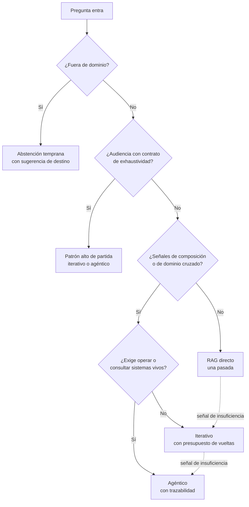

# 12 · El router: que el sistema elija

El piloto que abre este capítulo duró dos semanas. Una cadena de retail con su asistente interno para responsables de tienda estrenó investigación agéntica con entusiasmo justificado: las consultas de expedientes complejos — incidencias de cadena de frío con cruces de normativa regional — se resolvían solas, con su informe. El problema apareció en el panel del día doce: el agente estaba investigando *todo*. El "¿cuánto stock mínimo debo tener del producto X?" — una pasada, tres segundos, toda la vida — estaba consumiendo cuatro minutos de planificación, herramientas y verificación. El piloto no tenía un mal agente: tenía un sistema sin filtro de entrada, un caño único por donde pasaba todo a la misma velocidad.

La corrección de urgencia de aquel piloto fue manual: alguien miraba las consultas y las repartía. Funcionó — y dejó la lección con forma de pregunta: ¿por qué lo hacía una persona si la matriz del capítulo once ya decía qué merece cada consulta? Lo que faltaba era la pieza que ejecutara la matriz en vivo, consulta a consulta, sin guardar la cola. Esta pieza tiene nombre propio en este libro: **el router**.

## Del manual al router: clasificar es barato, investigar es caro

El router es el componente que recibe cada pregunta y decide con qué patrón del espectro se responde, aplicando la matriz de decisión en tiempo real. Su justificación cabe en una asimetría que ya recorrió todo el libro: **clasificar una pregunta cuesta una fracción de lo que cuesta responderla** — y si la clasificación es buena, casi todas las preguntas reciben el patrón mínimo que merecen, y solo las que de verdad lo exigen pagan el precio de la investigación.

La palabra "mínimo" es la del contrato, no del desprecio. Enviar al directo una pregunta de expediente no es eficiencia: es infrarrespuesta, y el usuario la paga con su tiempo de verificar. Enviar al agente una pregunta de catálogo no es calidad: es sobre-respuesta, y la organización la paga en minutos y tokens. El router existe para minimizar los dos errores a la vez, y esa dualidad — dos formas de fallar, no una — ordena todo su diseño.

Conviene fijar qué *no* es el router para evitar la confusión de catálogo. No es un modelo más grande delante de los demás: su trabajo no es responder sino clasificar, y una clasificación bien rubricada es una llamada corta con salida estructurada — familia, patrón, motivo. No es un muro: toda pregunta pasa, ninguna se rechaza — lo que se reparte es el presupuesto de pensamiento, no el acceso. Y no es un lujo de sistemas maduros: es la pieza que hace *sostenible* la mezcla de patrones; sin él, la mezcla degenera en uno de los dos uniformes del capítulo dos — todo rápido y torpe, o todo lento y caro.

## Las señales que el router lee

La calidad de un router se juega en qué mira antes de decidir. Hay cinco señales, ordenadas de la más débil a la más fuerte, y conviene conocerlas todas porque los routers ingenuos usan solo las tres primeras.

La primera es la **superficie de la pregunta**: longitud, interrogantes, estilo. Es débil — las preguntas largas pueden ser fácticas y las de tres palabras, compuestas — pero cuesta nada y desempata. La segunda es el **diagnóstico de alcance**: las señales de composición del capítulo cinco — plurales con cruce, "en cuáles de", verbos de cálculo, referencias a sistemas vivos — que delatan el peldaño del espectro. Es la señal técnica principal, y un modelo de clasificación entrenado con las familias de la matriz la lee bien.

La tercera es la **detección de dominios**: qué áreas del corpus toca la pregunta — una, varias, ninguna. Cruzar dos dominios es señal de complejidad; tocar ninguno es señal de abstención temprana, que también es una decisión del router: mejor declarar "eso está fuera de este servicio" que encaminar al vacío.

La cuarta es la **historia**: la misma pregunta reformulada en la misma semana, el usuario que vuelve tras una respuesta insuficiente, la conversación donde el anterior intento quedó a medias. La repetición es la firma clásica del falso barato — la primera pasada respondió poco — y el router que la lee corrige en la segunda visita lo que la primera se dejó. Su riesgo es su falso amigo: la pregunta repetida por distinta persona puede ser simplemente volumen, no insuficiencia; se distingue por el contexto, no por el texto.

Y la quinta, la más fuerte, es la **audiencia**: quién pregunta — con qué contrato firmado. El letrado con contrato de exhaustividad empieza por arriba aunque su pregunta parezca fácil; la gestora con contrato de segundos empieza por abajo aunque parezca compleja. La audiencia es la señal que el capítulo once preparó: es la matriz ya resuelta para esa persona. Un router que la lee primero puede resolver la mayoría de sus decisiones con una consulta a la tabla y reservar las señales técnicas para el margen.

## El escalado progresivo: barato primero, caro con pruebas

Con las señales leídas, la regla de encaminamiento de este libro cabe en un principio y una excepción. El principio: **escalado progresivo** — cada pregunta se encamina al patrón más barato que su diagnóstico justifique, y se escala al siguiente peldaño solo cuando aparece evidencia de que el actual no alcanza. La excepción: las audiencias con contrato de exhaustividad, que empiezan por arriba con razón — su matriz ya lo decidió, y volver a decidirlo por pregunta sería ignorar el contrato.

Las flechas discontinuas del diagrama son la mitad del diseño: las **escalas en caliente**. Un router serio no solo clasifica al inicio — reevalúa a mitad de camino. La señal de insuficiencia del directo — la réplica interna del capítulo seis es quien la detecta mejor — activa el peldaño siguiente sin que el usuario vuelva a preguntar: la misma conversación sube de patrón, y el panel registra la subida. Ese reencaminamiento en vivo es lo que distingue el escalado progresivo de una simple clasificación estática: el barato primero *con derecho a subir*, que es muy distinto de condenar al barato.

El presupuesto de la escalada se gobierna como todos los presupuestos del libro: máximo de subidas por consulta — dos, en el diseño canónico: directo → iterativo → agéntico — y salida digna al fondo: si tras la última escala la respuesta sigue sin respaldo, toca la abstención honesta del capítulo trece, que es preferible a una tercera investigación.

## Un router mínimo para empezar

Conviene decir, para el lector que ya está calculando proyectos, que el router no exige ingeniería de clasificadores para empezar. La primera versión útil de este componente cabe en cinco reglas escritas — y esa es, de hecho, la forma recomendada de estrenarlo, porque cada regla es legible, discutible y mejorable en el triaje.

Regla uno: si la audiencia tiene contrato de exhaustividad, patrón alto de partida. Regla dos: si la pregunta lleva señales de composición — plural con cruce, "en cuáles de", verbos de cálculo —, iterativo como mínimo. Regla tres: si toca dominios del corpus que no existen, abstención temprana con sugerencia de destino. Regla cuatro: si menciona sistemas vivos — "nuestra base de datos", "el expediente adjunto" — o pide operaciones, agéntico. Regla cinco: la familia por omisión — todo lo que no dispara señal alguna — va al directo, con la réplica interna de guardia y derecho a escalar en caliente. El orden importa: la abstención se comprueba antes de encaminar a los patrones caros, porque ninguna investigación paga un vacío.

Ese quinteto cubre, en los sistemas reales, la mayoría del encaminamiento con una precisión que sorprende porque viene de la matriz, no de un modelo: las reglas son la matriz traducida a texto ejecutable. La sofisticación — un clasificador entrenado con las familias, las señales de historia, el reencaminamiento fino — llega después, cuando la matriz de confusión del quinteto muestre dónde se queda corto. El camino del router es el de todo el libro: decisión legible primero, sofisticación medida después.

## El precio de enrutar mal: dos errores, dos paneles

El router añade al sistema un componente que también se equivoca, y su contabilidad de errores tiene dos columnas con nombres propios.

El **falso barato** — la pregunta compleja encaminada a una pasada — produce respuestas pobres con buen aspecto. Su coste lo paga el usuario en tiempo de verificación y la organización en confianza; su huella está en la cuarta señal, la historia: las repeticiones, las escaladas manuales, las preguntas que el usuario abandona. El **falso caro** — la pregunta fácil investigada en profundidad — produce respuestas excelentes que nadie necesitaba a ese precio. Su coste lo paga el presupuesto, y su huella está en los paneles de latencia y gasto: familias enteras consumiendo múltiplos sin que la consecuencia del error lo justifique.

Los dos errores se miden con la misma herramienta: la **tasa de acierto del router contra la matriz**. Se toma una muestra de consultas encaminadas, se comprueba contra la fila que la matriz habría asignado, y se construye la matriz de confusión — qué familias se encaminan mal, en qué dirección, con qué frecuencia. Esa revisión entra en el triaje semanal con las demás señales: un router sin matriz de confusión es un repartidor a ciegas con muy buen aspecto.

## La observabilidad del router

Todo lo anterior exige que el router deje rastro, y el rastro del router tiene cuatro campos mínimos: la pregunta (su identificador), las señales que leyó, el patrón asignado con su motivo, y las escalas en caliente que ocurrieron — con el motivo de cada subida. Ese registro sirve a tres niveles a la vez: al usuario, porque la explicación de "por qué tardó esto tanto" está a un clic; al equipo, porque la matriz de confusión sale de aquí; y al bucle de retorno del capítulo diecisiete, porque los errores de encaminamiento son la señal más pura de que la matriz necesita una fila nueva o una fila corregida.

Y un matiz de gobernanza que cierra el capítulo y la parte: el router es la pieza donde la matriz — un documento de negocio — se convierte en comportamiento técnico. Por eso sus criterios de encaminamiento deben ser **legibles y versionados como la matriz misma**: no una red neuronal inescrutable que "aprendió" a repartir, sino reglas que un humano puede revisar y discutir — *esta familia, este contrato, este patrón*. La sofisticación del router está en sus señales, no en su opacidad. Cuando la matriz cambia en el triaje, el router cambia con ella, en la misma semana, con la misma trazabilidad que cualquier otra pieza de la serie.

## Preguntas que hace el oficio

**¿El router no es una latencia más delante de todo?** Una mínima, y la más rentable del sistema: una llamada corta de clasificación — milisegundos si son reglas escritas, décimas de segundo si es un modelo, céntimos de céntimo en ambos casos — decide si la consulta paga tres segundos o tres minutos. Sin router, esa decisión la toma la omisión; con él, la toma la matriz. La única latencia realmente cara es la del patrón equivocado.

**¿Qué pasa si el router se equivoca y el usuario sabe más que él?** Se da la vuelta al usuario, con elegancia: las interfaces serias de los patrones altos ofrecen la vía de subida manual — "¿la respuesta no fue suficiente? Investigar a fondo" —. Esa acción del usuario es, además, señal de oro para la matriz de confusión: el encaminamiento que el humano corrige es el hallazgo más barato del triaje.

**¿El router sustituye a la matriz?** La ejecuta, no la sustituye. La matriz es la decisión de negocio — qué merece cada familia; el router es su traducción en vivo — qué merece esta consulta. Cuando la matriz cambia, el router cambia; un router sin matriz detrás es un clasificador huérfano que aprende de sus sesgos.

**¿Puedo tener varios routers?** Se tiene uno por puerta. Lo que sí hay es enrutado en capas — el router de familia, y dentro de los patrones altos sus propios reguladores: el presupuesto de pasos del agente, el techo de vueltas del iterativo. Cada capa aplica la parte de la matriz que le toca; ninguna decide de más.

**¿El router puede encaminar por coste en tiempo real — apagar el agente cuando el presupuesto del mes corre?** Puede, y es una política legítima — pero escrita, no improvisada: si el presupuesto mensual de investigación es una cláusula del contrato del negocio, el router la ejecuta como ejecuta la matriz, y el panel anuncia la degradación de servicio antes de que el usuario la sufra. Lo que no se sostiene es el encaminamiento por pánico de fin de mes: esa es la señal de que la contabilidad del capítulo diez se aprobó mal — o de que la cola fácil está subsidiando una cola difícil sin que nadie lo decidiera. El presupuesto se gestiona en la matriz y en el triaje; el router solo lo aplica.

!!! note "Criterio de salida"
    El router operativo con sus cuatro piezas mínimas: las señales que lee documentadas y en orden de prioridad (audiencia, composición, dominios, historia, superficie); la regla de escalado progresivo con sus máximos de subida y sus escalas en caliente; el registro de encaminamiento con motivo por consulta; y la matriz de confusión contra la matriz de decisión revisada en el triaje semanal. Un router sin confusión medida no está encaminando: está adivinando con buena letra.

Con el router, la parte de la decisión está completa: el espectro, el precio y el mecanismo que reparte en vivo. La parte cuarta baja a la última capa: qué hace el modelo con el material que recibe — cómo redacta, cómo se comprueba lo que dice, y quién juzga el resultado.
